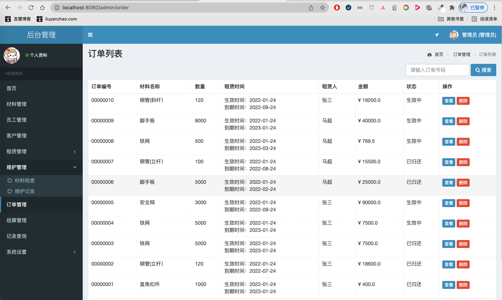

- 基于SpringBoot/SSM的脚手架租赁系统
- 预览地址：[http://material.liuyanzhao.com](http://material.liuyanzhao.com)
- 详细介绍地址：[https://liuyanzhao.com/shop/material.html](https://liuyanzhao.com/shop/material.html)
- 完成时间：2022年1月

# 一、需求
## 管理员
- 材料管理：材料名称、材质、规格、单位、月单价、数量
    - 常规的增删改查功能，但这里面的增删改是对材料数量的修改，而不是直接把这个材料删除。点击材料名称跳转相关材料的前台界面。
- 员工管理：姓名、性别、年龄、职称、电话、住址、工资
    - 不同职称有不同工资，不同职称的员工职责不在项目中体现，因此不同职称的员工在此项目的权限相同。
- 租赁管理：
    - 新购入材料：材料名称、材质、规格、单位、数量、日期
    - 租出材料：材料名称、材质、规格、单位、月单价、数量、租赁人、订单编号
- 维护管理： 
    - 材料检查：订单编号 材料名称 数量 归还日期 操作
        - 此列表列出所有归还的材料，管理员通过相关操作判断这些材料中哪些有损坏哪些可维修
    - 维护记录:材料名称 数量 存在问题 状态（已维修/待维修/损坏）操作 
        - 通过材料检查中管理员的操作列出各材料的问题，管理员在这里可以单击按钮把待维修的材料更改为已维修，而已维修的材料数量会添加会相应材料的总数中
- 订单管理：订单编号 材料名称 数量 租赁时间 租赁人 金额 操作
- 结算管理：日期（年月）月收入（该月产生的订单收入）员工工资（所有员工的总工资） 盈利（月收入-员工工资）  操作
- 单击按钮可以查看各项详情，本月共产生多少订单和共要结算多少工人，各工人工资为多少。
- 权限管理：可以把账号更改成用户、员工或管理员权限
- 记录查询：只要是对材料信息进行了修改或者员工对归还的材料进行操作都会在此进行记录

## 员工
- 个人信息： 姓名、性别、年龄、职称、电话、住址
- 材料管理：材料名称、材质、规格、单位、月单价、数量、操作
- 常规的增删改查功能，但这里面的增删改是对材料数量的修改，而不是直接把这个材料删除。点击材料名称跳转相关材料的前台界面。
- 维护管理
    - 材料检查：订单编号 材料名称 数量 归还日期 操作
	此列表列出所有归还的材料，员工通过相关操作判断这些材料中哪些有损坏哪些可维修
    - 维护记录:材料名称 数量 存在问题 状态（已维修/待维修/损坏） 操作 
    通过材料检查中员工的操作列出各材料的问题，员工在这里可以单击按钮把待维修的材料更改为已维修，而已维修的材料数量会添加会相应材料的总数中

## 用户
- 登录后进入前台租赁页面 用户在此页面对材料进行租赁
- 个人信息：账号 用户名 真实姓名 性别 手机号 地址 邮箱 
- 查看订单: 订单编号 材料名称 数量 租赁时间 金额  状态 操作
- 用户查看订单上可以通过单击查看订单详情 也可以通过单击选择归还或续租材料
（在租赁时间内提前归还材料金额不变）
- 订单详情包括：  
    - 订单信息（订单编号、金额、当前状态、租赁时间）
    - 材料信息（材料名称 材质和规格 单位 月单价） 
- 租赁方信息（真实姓名、电话、地址、邮箱）
 
 
# 二、技术组成
- 1、SpringBoot 或 SSM
- 2、MyBatis
- 3、Thymeleaf
- 4、Bootstrap
- 5、MySQL

# 三、项目截图
1-首页1.png

2-首页2.png

3-登录.png

4-注册.png

5-找回密码.png

6-材料详情.png

7-租用材料.png

8-订单详情.png

9-订单列表.png

10-订单续租和归还.png

11-客户个人信息.png

12-修改库存数量.png

13-编辑材料信息.png

14-检查列表.png

15-填写检查结果.png

16-维修记录.png

17-填写维修记录.png

18-员工个人信息.png

19-新购入材料列表.png

20-创建新材料.png

21-材料管理.png

22-员工管理.png

23-客户管理.png

24-租出材料管理.png

25-材料检查列表.png

27-维护记录列表.png

28-订单管理.png

29-结算管理.png

30-记录查询.png

31-角色管理.png

32-权限管理.png

33-岗位薪资管理.png

# 四、联系方式
需要完整代码联系博主，微信847064370

